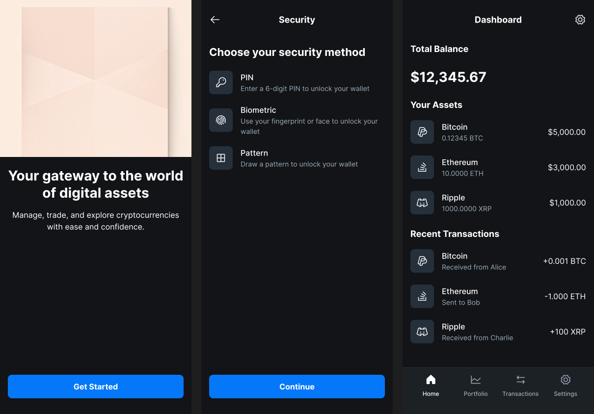

# 🎨 Figma-Friendly UI Mockups  

This repository contains clean, editable **SVG mockups** that can be directly imported into [Figma](https://www.figma.com/) for further design work.  

---

## 📱 Screens  

### ✈️ Travel Planner  
  

🔗 [Open SVG](Travel%20Planner.svg)  

---

### 💰 Crypto Wallet  
  

🔗 [Open SVG](Crypto.svg)  

---

## 📂 How to Use  

1. **Download or Clone** this repo.  
2. Access the `.svg` files (`Crypto.svg` and `Travel Planner.svg`).  
3. Drag and drop any `.svg` file into **Figma** to start editing.  
4. You can also embed these SVGs in documentation or web apps.  

---

## 🛠️ Tech  

- **Format:** SVG (Scalable Vector Graphics)  
- **Editable:** Fully vector-based, compatible with Figma / Illustrator / Web projects  
- **Purpose:** Quick UI prototyping & design sharing  

---

## 📜 License  

Feel free to use and modify these designs. Attribution is appreciated but not required.  
